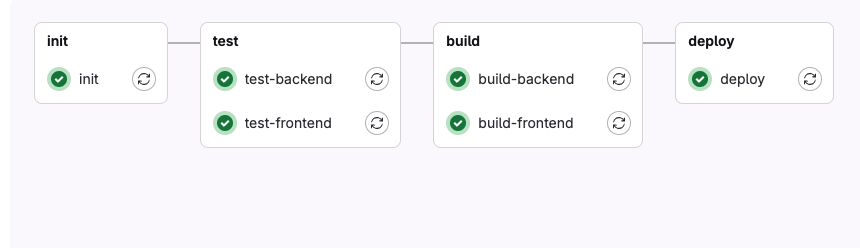

Documentation
=============

.. contents::
   :local:
   :depth: 2

This project is a template for TYPO3 CMS projects with continuous integration and deployment using GitLab CI/CD and Deployer.

For now it uses only Gitlab CI/CD.

**The aim is to have minimal config at gitlab-ci.yaml of projects and keep the base of CI/CD config outside of projects' repositories.**

You can use this repository for several possible ways:

1. Clone it whole and use as own base with "include remote".
2. Reference it from your project with "include remote" and overwrite at your projects' ``gitlab-ci.yaml``.
3. Reference it from your project with "include remote" and overwrite it with "include remote" from your own CI/CD special repo
   and overwrite edge cases at projects` ``gitlab-ci.yaml``.

The worst possible scenario you can use is to copy all CI/CD files to your project repository and maintain it there for each project.
This is not recommended as it will be hard for you to maintain and upgrade in the future if you have several dozen of projects
and each own CI/CD config inside projects' repo.

Installation
~~~~~~~~~~~~

1. Install with composer: ``composer require sourcebrokergit/deployer-typo3-ci``.
2. Create file ``.gitlab-ci.yml`` in the root of your project and put there the content below. Adapt the values in
   ``PHP``, ``NODE``, ``DEPLOY_TRIGGER_BY_CI_COMMIT_BRANCH``, ``DEPLOYER_BRANCH_TO_SELECTOR`` and ``DEPLOYER_TAG_TO_SELECTOR``
   to your needs. Adapt the tag version in the include remote url. The version is the version of the deployer-typo3-ci
   you want to use. If after push pipeline does not start at all check the ``TEST_TRIGGER_BY_CI_COMMIT_BRANCH`` value.
   The name of branch you push to must be inside pregmatch of ``TEST_TRIGGER_BY_CI_COMMIT_BRANCH``

   .. code-block:: yaml

       include:
         - remote: https://raw.githubusercontent.com/sourcebrokergit/deployer-typo3-ci/0.0.21/ci/provider/gitlab/main.yml

       variables:
         PHP: '8.2'
         NODE: '20'
         DEPLOY_TRIGGER_BY_CI_COMMIT_BRANCH: /^(beta|main)$/
         DEPLOYER_BRANCH_TO_SELECTOR: beta:staging,main:production
         DEPLOYER_TAG_TO_SELECTOR: production

3. **Backend test**.
   The command for backend test is defined in ``BACKEND_COMMAND_TEST`` and has value:
   ``composer install --prefer-dist --no-progress --no-interaction --optimize-autoloader && composer test``.
   You can either overwrite it in your ``.gitlab-ci.yml`` or you can just add "test" script in your composer.json.

4. **Frontend test**.
   The command for frontend test is defined in ``FRONTEND_COMMAND_TEST`` and has value:
   ``cd assets && npm ci && npm run test``. This is probably part you would like to overwrite as this is very custom and
   not normalised at TYPO3 world. Just change ``FRONTEND_COMMAND_TEST`` to your needs in your ``.gitlab-ci.yml``.

5. **Build the backend**.
   The command for backend build is defined in ``BACKEND_COMMAND_BUILD`` and has value:
   ``composer install --prefer-dist --no-progress --no-interaction --optimize-autoloader --no-dev``
   You probably do not want to overwrite it as this is default for all PHP projects.

6. **Build the frontend**.
   The command for frontend build is defined in ``FRONTEND_COMMAND_BUILD`` and has value:
   ``cd assets && npm ci && npm run production``. You can either overwrite it in your ``.gitlab-ci.yml``. If you modify
   the ``FRONTEND_COMMAND_TEST`` command remember to also modify the ``FRONTEND_FOLDER_BUILD_1``.

7. **Deploy**.
   Add ``SSH_PRIVATE_KEY`` variable to your GitLab project CI/CD settings as "mask variable". This variable hold
   the private key for the user that will deploy the project from deployer level. Prepare this ``SSH_PRIVATE_KEY`` with
   following command: ``cat privatekey | base64 -w0`` and on mac ``cat privatekey | base64 -b0``

8. Define your deployer configuration in your project's ``deploy.php`` file. Example of real working configuration:

   .. code-block:: php

      <?php

        namespace Deployer;
        require_once(__DIR__ . '/vendor/sourcebroker/deployer-loader/autoload.php');
        new \SourceBroker\DeployerTypo3Ci\Loader();

         host('live')
            ->setHostname('vm-dev.example.com')
            ->setRemoteUser('deploy')
            ->set('bin/php', '/home/www/t3base13-public/live/.bin/php');
            ->set('public_urls', ['https://live-t3base13.example.com'])
            ->set('deploy_path', '/home/www/t3base13/live');

        host('beta')
            ->setHostname('vm-dev.example.com')
            ->setRemoteUser('deploy')
            ->set('bin/php', '/home/www/t3base13-public/beta/.bin/php');
            ->set('public_urls', ['https://beta-t3base13.example.com'])
            ->set('deploy_path', '/home/www/t3base13/beta');

   Those two lines are required in your ``deploy.php`` file:

   .. code-block:: php

     require_once(__DIR__ . '/vendor/sourcebroker/deployer-loader/autoload.php');
     new \SourceBroker\DeployerTypo3Ci\Loader();

9. Push the changes to your repository and see the pipeline at your project.

Stages
~~~~~~

- **Init Stage** (``ci/provider/gitlab/config/300-init.yaml``):

  - Initializes the environment.

- **Test Stage**:

  - **Backend Tests** (``ci/provider/gitlab/config/400-test-backend.yaml``): Runs backend tests.
  - **Frontend Tests** (``ci/provider/gitlab/config/410-test-frontend.yaml``): Runs frontend tests.

- **Build Stage**:

  - **Backend Build** (``ci/provider/gitlab/config/500-build-backend.yaml``): Builds the backend.
  - **Frontend Build** (``ci/provider/gitlab/config/510-build-frontend.yaml``): Builds the frontend.

- **Deploy Stage** (``ci/provider/gitlab/config/600-deploy.yaml``):

  - Deploys the application using Deployer.

Variables
~~~~~~~~~

- **Variables** (``ci/provider/gitlab/config/100-variables.yaml``):

  - ``PHP`` PHP version for backend test and build.
  - ``NODE`` PHP version for frontend test and build.
  - ``TEST_TRIGGER_BY_CI_COMMIT_BRANCH`` Regexp for branches that trigger pipeline for test only.
  - ``TEST_TRIGGER_BY_CI_COMMIT_TAG`` Regexp for tags that trigger pipeline for test only.
  - ``DEPLOY_TRIGGER_BY_CI_COMMIT_TAG`` Regexp for tags that trigger deploy.

- **Backend Variables** (``ci/provider/gitlab/config/110-variables-backend.yaml``):

  - ``BACKEND_COMMAND_TEST`` Command to run backend tests.
  - ``BACKEND_COMMAND_BUILD`` Command to build the backend.
  - ``BACKEND_IMAGE`` Docker image for the backend.
  - ``BACKEND_FOLDER_BUILD_*`` Paths for backend build artifacts.

- **Frontend Variables** (``ci/provider/gitlab/config/120-variables-frontend.yaml``):

  - ``FRONTEND_COMMAND_TESTS`` Command to run frontend tests.
  - ``FRONTEND_COMMAND_BUILD`` Command to build the frontend.
  - ``FRONTEND_IMAGE`` Docker image for the frontend.
  - ``FRONTEND_FOLDER_BUILD_*`` Paths for frontend build artifacts.

- **GitLab Variables** (``ci/provider/gitlab/config/130-variables-gitlab.yaml``):

  - ``FF_USE_FASTZIP`` Enable fast zip for artifacts.
  - ``ARTIFACT_COMPRESSION_LEVEL`` Compression level for artifacts.
  - ``CACHE_COMPRESSION_LEVEL`` Compression level for cache.
  - ``TRANSFER_METER_FREQUENCY`` Frequency of transfer meter updates.
  - ``DOCKER_DRIVER`` Docker driver to use.
  - ``DOCKER_BUILDKIT`` Enable Docker BuildKit.
  - ``BUILDKIT_INLINE_CACHE`` Enable inline cache for BuildKit.
  - ``COMPOSE_DOCKER_CLI_BUILD`` Enable Docker CLI build for Compose.

Deployer Tasks
~~~~~~~~~~~~~~

The project uses Deployer for deployment tasks. The configuration files are located in the `deployer/default` directory.

- **Cache Management**:

  - ``typo3cms:cache:flush:pages`` Flushes TYPO3 CMS page cache.
  - ``typo3cms:cache:warmup:system`` Warms up TYPO3 CMS system cache.

- **Extension Management**:

  - ``typo3cms:extension:setup`` Sets up TYPO3 CMS extensions.

- **Language Management**:

  - ``typo3cms:language:update`` Updates TYPO3 CMS languages.

- **Deployment**:

  - ``deploy:upload_build`` Uploads the build to the server.
  - ``deploy-ci`` Main deployment task for continuous integration.

Own repo for overwrites
~~~~~~~~~~~~~~~~~~~~~~~

You can be interested in creating your own repo with values for overwriting variables of ``sourcebrokergit/deployer-typo3-ci``

Good candidates for overwrites are ``DEPLOY_TRIGGER_BY_CI_COMMIT_BRANCH``, ``DEPLOYER_BRANCH_TO_SELECTOR``,
``DEPLOYER_TAG_TO_SELECTOR``, ``FRONTEND_COMMAND_TEST``, ``FRONTEND_COMMAND_BUILD``.
The values there will depend on your branches' naming policies, deployer selector and when to do test, builds and deployments.

Then you should add your remote inclusion at ``.gitlab-ci.yml``. Example:

.. code-block:: yaml

   include:
     - remote: https://raw.githubusercontent.com/sourcebrokergit/deployer-typo3-ci/0.0.21/ci/provider/gitlab/main.yml
     - remote: https://raw.githubusercontent.com/my_company/deployer-typo3-ci/1.0.0/ci/provider/gitlab/overrides.yml
